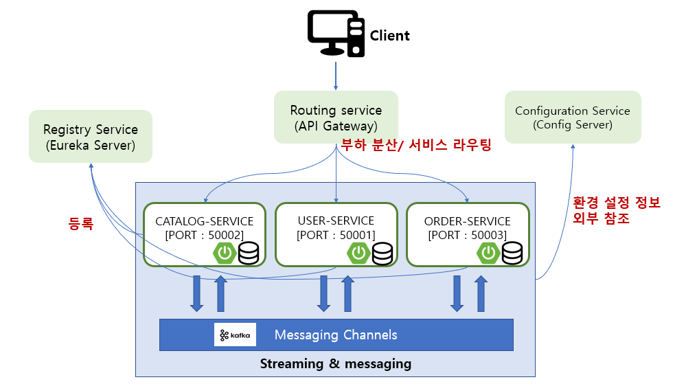
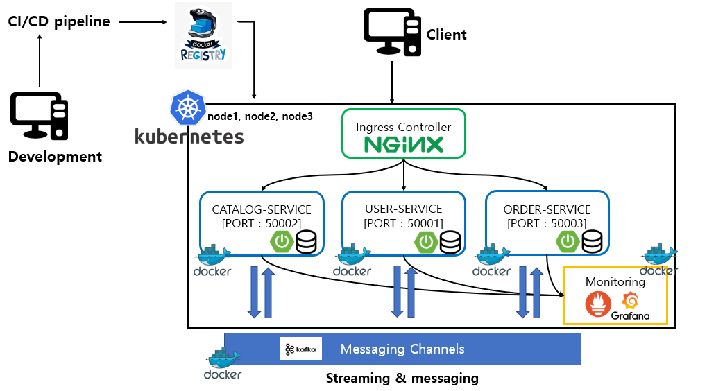
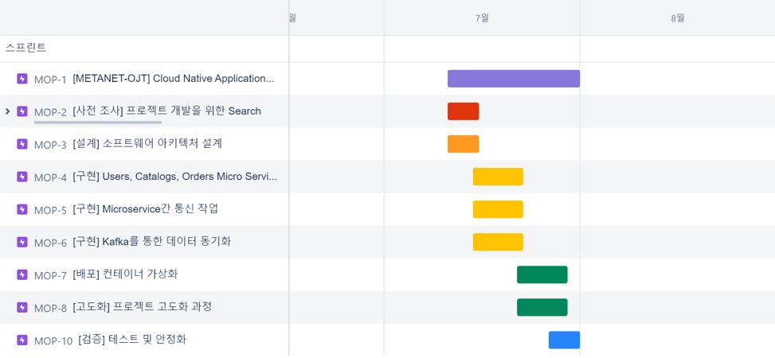

# MSA-Project-Example   
  
> MSA 구조 기반 Cloud Native Application 토이프로젝트 입니다.   
    

## 프로젝트 구성

### apigateway-service
    [Spring Cloud Gateway]
    Spring Security Filter 처리
    마이크로서비스 부하 분산 및 서비스 라우팅

### config-service
    [Spring Cloud Config]
    마이크로서비스 소스 관리 및 프로파일 관리

### discovery-service
    [Eureka]
    마이크로서비스 등록 및 검색

### order-service
    [MicroService]
    주문에 대한 서비스

### user-service
    [MicroService]
    유저에 대한 서비스

### catalog-service
    [MicroService]
    상품(카테고리)에 대한 서비스

## 구성도

## 목표 설계

## WBS

